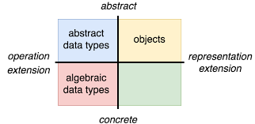
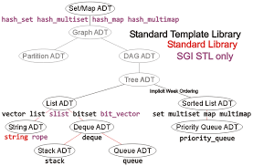

# COMP-410--Data-structures

Data Structures are the basis of how we store data and perform operations on them, such as access(), delete() and sort() etc. in the most effiecient manner. In this repositiry we deal with Abstarct data types, which are mathematical models for data types, where a data type is defined by its behavior from the point of view of a user of the data

                                                         

  
